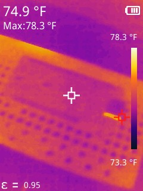
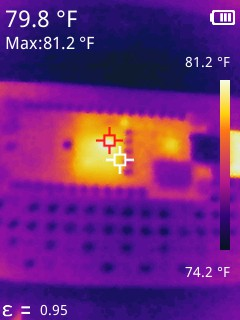
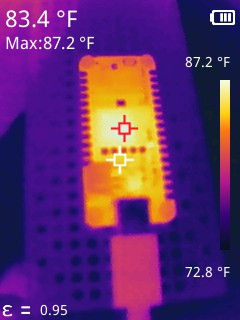
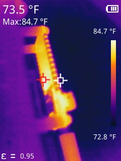
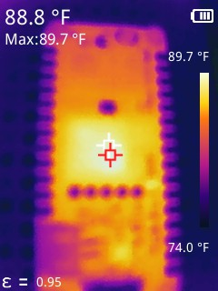
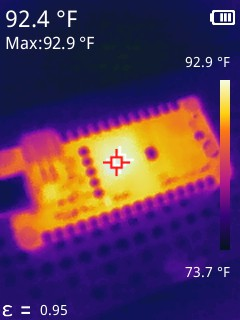

# 01 Smoke Test

Goal here was to smoke test my new OrangeCrab 85F board. Result is that the
board appears to be working fine with no obvious hardware faults. The charge
LED lights up green, the RGB LED cycles through a few colors, and the
surface temperatures seem reasonable.

<video controls muted width="854" height="480">
<source src="01_smoke_test_480p.mp4" type="video/mp4" />

[video of OrangeCrab LED fading through a cycle of blue, green, red, ...]

</video>

## Thermal

1. Ambient before power-up:

   

2. Powerup +0m13s:

   

3. Powerup +2m03s:

   

4. Powerup +2m29s (bottom of board):

   

5. Powerup +3m54s:

   

6. Powerup +20m09s:

   

## Visible

The board looks like this with a regular camera:

