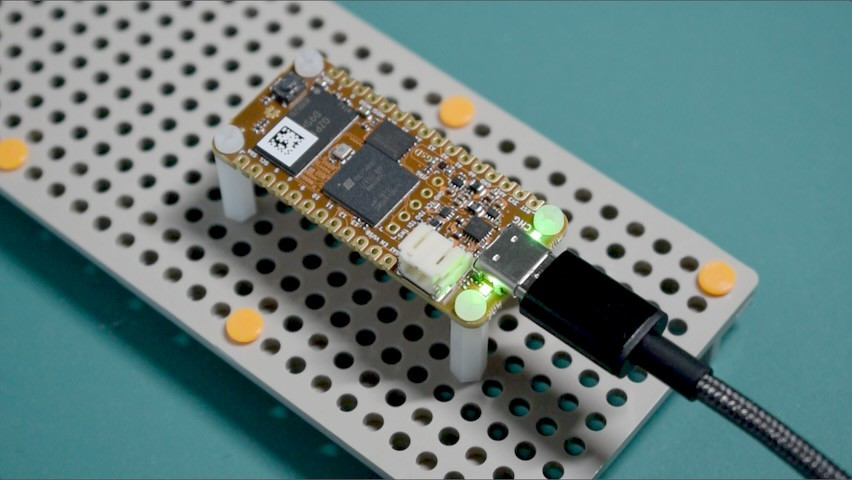

# ocfpga

Notes on OrangeCrab 85F ECP5 fpga dev board experiments.

<!--
### Contents

- [Experiments](#experiments)
- [Software Links](#software-links)
- [Documentation Links](#documentation-links)
- [Where to Buy](#where-to-buy)
-->

## Experiments

- [02 Check USB Devices](experiments/02_check_usb_devices/README.md)
- [01 Smoke Test](experiments/01_smoke_test/README.md)

## Software Links

- Github [orangecrab-fpga/production-test-sw](https://github.com/orangecrab-fpga/production-test-sw):
  Software, firmware, and gateware for OrangeCrab text fixture (probably a good
  starting point to understand how DFU boot mode works)
- Github [orangecrab-fpga/orangecrab-examples](https://github.com/orangecrab-fpga/orangecrab-examples):
  Example projects and code for OrangeCrab (probably good starting point for
  learning how to build riscv SoCs with Litex or Amaranth)
- Github [gregdavill/circuitpython](https://github.com/gregdavill/circuitpython/tree/orangecrab/ports/litex/boards/orangecrab)
  (orangecrab branch): 4 year old CircuitPython port for OrangeCrab (likely
  broken or incomplete? but it has interesting Litex stuff.)

## Documentation Links

- [orangecrab-fpga.github.io/orangecrab-hardware](https://orangecrab-fpga.github.io/orangecrab-hardware/):
  HTML docs with hardware specs, pinouts, and
  [Getting Started](https://orangecrab-fpga.github.io/orangecrab-hardware/docs/getting-started/)
  guide
- DigiKey [OrangeCrab r0.2 data sheet](https://groupgets-files.s3.amazonaws.com/Digikey_Marketplace/orangecrab_datasheet-r0.2.pdf)
- GroupGets [OrangeCrab product page](https://groupgets.com/products/orange-crab-85f-lattice-ecp5-fpga-development-kit)
  (scroll down for various links in the product description)
- Github [orangecrab-fpga/orangecrab-hardware](https://github.com/orangecrab-fpga/orangecrab-hardware):
  for r0.2.1 schematic pdf, see [hardware/orangecrab_r0.2.1/Production/OrangeCrab_r0.2.1_sch.pdf](https://github.com/orangecrab-fpga/orangecrab-hardware/blob/main/hardware/orangecrab_r0.2.1/Production/OrangeCrab_r0.2.1_sch.pdf)
- Github [mwelling/orangecrab-test](https://github.com/mwelling/orangecrab-test):
  Design files for Orangecrab test fixture. Maybe useful for understanding what
  factory test firmware does? Schematic is at
  [orangecrab-test.pdf](https://github.com/mwelling/orangecrab-test/blob/master/orangecrab-test.pdf)
- Lattice Semiconductor [ECP5 product page](https://www.latticesemi.com/Products/FPGAandCPLD/ECP5):
  for ECP5 family data sheet and related guides, scroll down to the
  [Documentation](https://www.latticesemi.com/Products/FPGAandCPLD/ECP5#_11D625E1D2C7406C96A5312C93FF0CBD)
  heading

## Where to Buy

These links are for the OrangeCrab 85F, which uses the 85F variant of the
[Lattice ECP5 fpga](https://www.latticesemi.com/Products/FPGAandCPLD/ECP5).
There is also an OrangeCrab 25F. If you want to reproduce experiments in
this repo, keep in mind that I'm using an OrangeCrab r0.2.1 85F.

- [DigiKey 2077-ORANGECRAB-R0D2-85-ND](https://www.digikey.com/en/products/detail/groupgets-llc/ORANGECRAB-R0D2-85/16894260)
- [GroupGets ORANGECRAB-R0D2-85](https://groupgets.com/products/orange-crab-85f-lattice-ecp5-fpga-development-kit)
