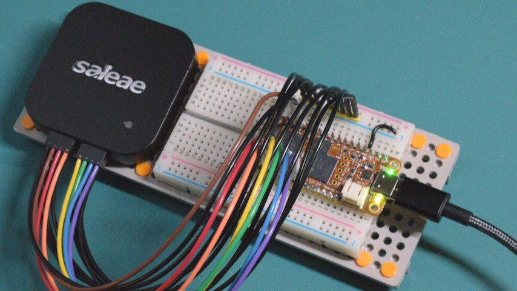

# ocfpga

Notes on OrangeCrab 85F ECP5 fpga dev board experiments.

## Experiments

- [04 Try Prebuilt Firmware](experiments/04_try_prebuilt_firmware/README.md)

- [03 Headers and Logic Analyzer](experiments/03_headers_and_logic_analyzer/README.md)

- [02 Check USB Devices](experiments/02_check_usb_devices/README.md)

- [01 Smoke Test](experiments/01_smoke_test/README.md)

## Documentation & Downloads

### OrangeCrab Software

- Github [orangecrab-fpga/production-test-sw](https://github.com/orangecrab-fpga/production-test-sw):
  Software, firmware, and gateware for OrangeCrab test fixture (probably a good
  starting point to understand how DFU boot mode works). The
  [prebuilt](https://github.com/orangecrab-fpga/production-test-sw/tree/main/prebuilt)
  directory has prebuilt bootloader and firmware images. The current 85F
  prebuilt bootloader is from 2021. Based on 1BitSquared \#orangecrab Discord
  (Feb 2024), it has a file size limit carried over from the 25F bootloader, so
  fully utilizing the gateware capacity of an r0.2.1 85F probably requires a
  patched bootloader to be flashed over jtag.

- Github [orangecrab-fpga/orangecrab-examples](https://github.com/orangecrab-fpga/orangecrab-examples):
  Example projects and code for OrangeCrab (probably good starting point for
  learning how to build riscv SoCs with Litex or Amaranth)

- Github [gregdavill/circuitpython](https://github.com/gregdavill/circuitpython/tree/orangecrab/ports/litex/boards/orangecrab)
  (orangecrab branch): 4 year old CircuitPython port for OrangeCrab (likely
  broken or incomplete? but it has interesting Litex stuff.)

- Github [gregdavill/foboot](https://github.com/gregdavill/foboot/tree/OrangeCrab)
  (OrangeCrab branch): OrangeCrab bootloader based on the Fomu bootloader. See
  notes above about prebuilt bootloader and firmware files in
  orangecrab-fpga/production-test-sw.

### OrangeCrab Hardware

- [orangecrab-fpga.github.io/orangecrab-hardware](https://orangecrab-fpga.github.io/orangecrab-hardware/):
  HTML docs with hardware specs, pinouts, and
  [Getting Started](https://orangecrab-fpga.github.io/orangecrab-hardware/docs/getting-started/)
  guide

- GroupGets [OrangeCrab product page](https://groupgets.com/products/orange-crab-85f-lattice-ecp5-fpga-development-kit)
  (scroll down for various links in the product description)

- [orangecrab-fpga/orangecrab-hardware](https://github.com/orangecrab-fpga/orangecrab-hardware)
  (Github): for r0.2.1 schematic pdf, see [hardware/orangecrab_r0.2.1/Production/OrangeCrab_r0.2.1_sch.pdf](https://github.com/orangecrab-fpga/orangecrab-hardware/blob/main/hardware/orangecrab_r0.2.1/Production/OrangeCrab_r0.2.1_sch.pdf)

- [mwelling/orangecrab-test](https://github.com/mwelling/orangecrab-test) (Github):
  Design files for Orangecrab test fixture. Maybe useful for understanding what
  factory test firmware does? Schematic is at
  [orangecrab-test.pdf](https://github.com/mwelling/orangecrab-test/blob/master/orangecrab-test.pdf)

- DigiKey [OrangeCrab r0.2 data sheet](https://groupgets-files.s3.amazonaws.com/Digikey_Marketplace/orangecrab_datasheet-r0.2.pdf)

### Related ECP5 Boards

- [ulx3s.github.io](https://ulx3s.github.io/): Project homepage for ULX3S. The
  [Projects and Examples](https://ulx3s.github.io/#projects-and-examples) and
  [Toolchains and Utilities](https://ulx3s.github.io/#toolchains-and-utilities)
  sections probably have useful information on building ECP5 gateware and
  firmware that could be adapted for use on OrangeCrab.

- [ulx3s/ulx3s-toolchain](https://github.com/ulx3s/ulx3s-toolchain) (Github):
  Scripts for installing ULX3S toolchain, including RISC-V compiler.

### ECP5 EDA Tools

- [YosysHQ](https://github.com/YosysHQ) (Github): Open Source EDA CAD suite with
  projects including Yosys, nextpnr, and Project Trellis

- [YosysHQ/yosys](https://github.com/YosysHQ/yosys) (Github): Open RTL synthesis
  tools to translate Verilog and SystemVerilog into RTL. (Litex depends on this)

- [YosysHQ/nextpnr](https://github.com/YosysHQ/nextpnr) (Github): Portable FPGA
  place and route tool to translate RTL into an FPGA-specific bitstream.

- [YosysHQ/prjtrellis](https://github.com/YosysHQ/prjtrellis) (Github):
  Documentation for Lattice ECP5 bitstream format and internal architecture.
  This may be useful for learning about which ECP5 features are available in
  nextpnr and how to make use of them.

- [danderson/ulxs LPF file format specification](https://github.com/danderson/ulxs/blob/main/lpf.md)
  (Github): Notes on using Lattice Preference File (LPF) file format to tell
  nextpnr how to configure the ECP5 FPGA. This was cited on 1BitSquared
  \#orangecrab Discord as a good source of info on configuring pin drive
  strength and slew rate.

### RISC-V Compiler Toolchains

- Embecosm [Tool Chain Downloads](https://www.embecosm.com/resources/tool-chain-downloads/):
  Prebuilt RISC-V toolchains with GNU binutils, gcc or clang compiler, gdb, and
  Newlib C standard library.

- [embecosm/embecosm-toolchain-releases](https://github.com/embecosm/embecosm-toolchain-releases)
  (Github): Build scripts and related dependencies for Embecosm toolchains. This
  could be useful as a reference for building C standard libraries for specific
  RISC-V instruction set extension combinations.

### Lattice (ECP5 family datasheets and guides)

- Lattice Semiconductor [ECP5 product page](https://www.latticesemi.com/Products/FPGAandCPLD/ECP5):
  for ECP5 family data sheet and related guides, scroll down to the
  [Documentation](https://www.latticesemi.com/Products/FPGAandCPLD/ECP5#_11D625E1D2C7406C96A5312C93FF0CBD)
  heading

## Where to Buy

These links are for the OrangeCrab 85F, which uses the 85F variant of the
[Lattice ECP5 fpga](https://www.latticesemi.com/Products/FPGAandCPLD/ECP5).
There is also an OrangeCrab 25F. If you want to reproduce experiments in
this repo, keep in mind that I'm using an OrangeCrab r0.2.1 85F.

- [DigiKey 2077-ORANGECRAB-R0D2-85-ND](https://www.digikey.com/en/products/detail/groupgets-llc/ORANGECRAB-R0D2-85/16894260)

- [GroupGets ORANGECRAB-R0D2-85](https://groupgets.com/products/orange-crab-85f-lattice-ecp5-fpga-development-kit)
