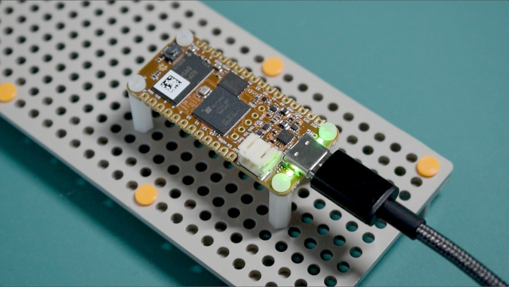

# ocfpga

Notes on OrangeCrab 85F ECP5 fpga dev board experiments.

## Experiments

- [01 Smoke Test](01_smoke_test/README.md)

## Links

### Datasheets and Other Documentation

- [OrangeCrab r0.2 data sheet](https://groupgets-files.s3.amazonaws.com/Digikey_Marketplace/orangecrab_datasheet-r0.2.pdf)
- [GroupGets OrangeCrab product page](https://groupgets.com/products/orange-crab-85f-lattice-ecp5-fpga-development-kit) (scroll down for various links in the product description)
- [orangecrab-hardware Github repo](https://github.com/orangecrab-fpga/orangecrab-hardware): for r0.2.1 schematic pdf, see [hardware/orangecrab_r0.2.1/Production/OrangeCrab_r0.2.1_sch.pdf](https://github.com/orangecrab-fpga/orangecrab-hardware/blob/main/hardware/orangecrab_r0.2.1/Production/OrangeCrab_r0.2.1_sch.pdf)
- Lattice Semiconductor [ECP5 product page](https://www.latticesemi.com/Products/FPGAandCPLD/ECP5): for ECP5 family data sheet and related guides, scroll down to the [Documentation](https://www.latticesemi.com/Products/FPGAandCPLD/ECP5#_11D625E1D2C7406C96A5312C93FF0CBD) heading

### Where to Buy

These links are for the OrangeCrab 85F, which uses the 85F variant of the
[Lattice ECP5 fpga](https://www.latticesemi.com/Products/FPGAandCPLD/ECP5).
There is also an OrangeCrab 25F. If you want to reproduce experiments in
this repo, keep in mind that I'm using an OrangeCrab r0.2.1 85F.

- [DigiKey 2077-ORANGECRAB-R0D2-85-ND](https://www.digikey.com/en/products/detail/groupgets-llc/ORANGECRAB-R0D2-85/16894260)
- [GroupGets ORANGECRAB-R0D2-85](https://groupgets.com/products/orange-crab-85f-lattice-ecp5-fpga-development-kit)
