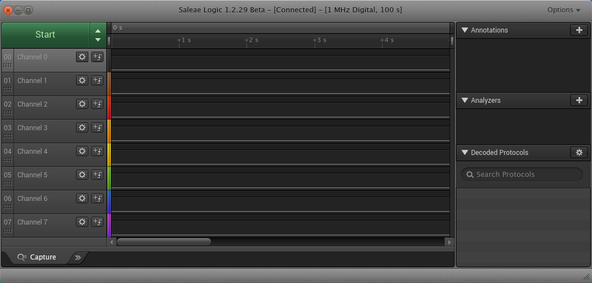

# Headers and Logic Analyzer

Goal: Prepare to use a logic analyzer to watch OrangeCrab pins.

Results: This is what my new hardware setup looks like:

## Hardware changes since last time:

1. Soldered headers for the OrangeCrab's Feather pins (nothing on JTAG yet).
   I used extra-long break-away 0.1" male header. After soldering, I cut off
   the top of the power-related header pins. The long pins make it easy to
   connect the logic analyzer jumpers. Trimming the power pins reduces my odds
   of accidentally shorting power rails.

2. Plugged OrangeCrab into a breadboard and mounted the breadboard with a piece
   of hookup wire to the same universal plate I was using previously.

3. Mounted Saleae Logic 8 to the universal plate with adhesive Velcro.

## Logic Analyzer Setup

My dev computer runs Debian, so I installed `Logic+1.2.29+(64-bit).zip` from
Saleae's
[legacy-software](https://support.saleae.com/logic-software/legacy-software/older-software-releases)
downloads page:

1. Unzip the archive into `~/bin/logic-1.2.29/`

2. Copy my calibration data file into `~/bin/logic-1.2.29/Calibration/`

3. Install the udev rule with `~/bin/logic-1.2.29/Drivers/install_driver.sh`

To start Logic, I run `~/bin/logic-1.2.29/Logic -override` from a terminal in
Xfce. I turned off preferences related to auto-updates and sending analytics.

This is how I connected the pins:

| Logic 8 | OrangeCrab |
| ------- | ---------- |
| 0 | 0 |
| 1 | 1 |
| 2 | SDA |
| 3 | SCL |
| 4 | 5 |
| 5 | 6 |
| 6 | 9 |
| 7 | 10 |

This is what I captured while booting the OrangeCrab into DFU mode (btn0 down
at powerup) with the factory default LED-blinking firmware:

The traces are pretty boring. Apparently the LED blinking firmware does not
output anything on those pins. That's fine though. The point was to

# Next Steps

Hopefully some of the other prebuilt firmware images (factory test?) will do
something interesting like sending async serial debug messages. I want to try
loading other firmware and watching its output with the logic analyzer.
