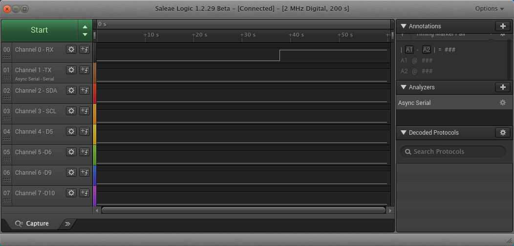

# 04 Try Prebuilt Firmware

Goals:

1. Figure out how, if possible, to read the factory LED blinking DFU firmware
   image

2. Figure out how, if possible, to write other prebuilt firmware images from

   https://github.com/orangecrab-fpga/production-test-sw/tree/main/prebuilt

   (I'm unsure if the factory test bitstreams can be flashed without JTAG)

3. Send some kind of output to one of the OrangeCrab pins then capture and
   decode that on my logic analyzer. For example, maybe some of this stuff
   would work:
   - https://github.com/orangecrab-fpga/orangecrab-examples


## Results

1. From the prebuilt binaries in orangecrab-fpga/production-test-sw, I can use
   `dfu-util` to load either `orangecrab-test-85F.bit` or
   `orangecrab-reboot-85F.bit` into the `-d 1209:5af0 alt=0` DFU defice. The
   reboot-85F one blinks green and then starts DFU mode when I press btn0. The
   test-85F one pulls pin 0 (silkscreen "0") high. It probably does a lot more,
   but I don't know how to trigger that stuff.

   

2. I can load the prebuilt `blink_fw.dfu` binary into `-d 1209:5af0 --alt 1`
   and run it with `dfu-util -d 1209:5af0 --alt 1 -e`. It makes the LED blink
   red.

3. The prebuilt `combine.dfu` binary from orangecrab-fpga/orangecrab-examples
   does not work. I can flash it if I change the product ID with `dfu-suffix`,
   but, when I do that and attempt to run it, the LED just does the bootloader
   rainbow fade thing. I assume maybe that's what happens if a bitstream fails
   to load?


## References

1. The OrangeCrab bootloader is based on a fork of the Fomu bootloader. The
   source code is here (OrangeCrab branch):
   - https://github.com/gregdavill/foboot/tree/OrangeCrab

   The README says a command called `dfu-util` can be used to read and write
   the DFU device's flash chip.

2. These links are for Debian Bookworm's `dfu-util` package (version 0.11-1):
   - package: https://packages.debian.org/bookworm/dfu-util
   - manpage: https://manpages.debian.org/bookworm/dfu-util/dfu-util.1.en.html

3. These links are for Ubuntu 22.04 LTS `dfu-util` package (version 0.9-1):
   - package: https://packages.ubuntu.com/jammy/dfu-util
   - manpage: https://manpages.ubuntu.com/manpages/jammy/en/man1/dfu-tool.1.html

4. dfu-util homepage:
   - https://dfu-util.sourceforge.net/


## Install Dependencies

1. Install Debian package for `dfu-util` (should also work for Ubuntu):

    ```
    $ sudo apt install dfu-tool
    $ dfu-util --version | grep '^dfu-util'
    dfu-util 0.11
    ```

2. Add a udev to give user accounts in the plugdev group +rw permissions for
   the OrangeCrab DFU device:

    ```
    $ cat <<EOF | sudo tee /etc/udev/rules.d/99-OrangeCrab-DFU.rules
    # OrangeCrab DFU bootloader (hold down btn0 button while plugging in USB)
    ACTION=="add", SUBSYSTEM=="usb", \
     ATTRS{idVendor}=="1209", ATTRS{idProduct}=="5af0", GROUP="plugdev", MODE="664"
    EOF
    ```

## Download Prebuilt OrangeCrab 85F Binaries

I wrote a script to do download the files and verify that they match expected
SHA256 digests. See [download-firmware.pl](download-firmware.pl).


## Notes on trying out dfu-util...

1. Try listing devices:

    ```
    $ man dfu-util
    $ dfu-util --list 2>&1 | perl -ne 'print if $n++ > 6'
    Deducing device DFU version from functional descriptor length
    dfu-util: Cannot open DFU device 05ac:8289 found on devnum 6 (LIBUSB_ERROR_ACCESS)
    dfu-util: Cannot open DFU device 1209:5af0 found on devnum 7 (LIBUSB_ERROR_ACCESS)
    ```

2. That error looks like I'm missing a udev rule. So, try adding a rule that
   gives the plugdev group rw permissions for 1209:5af0:

    ```
    $ lsusb | grep DFU
    Bus 001 Device 007: ID 1209:5af0 Generic OrangeCrab r0.2 DFU Bootloader v3.1-6-g62e92e2
    $ cat <<EOF | sudo tee /etc/udev/rules.d/99-OrangeCrab-DFU.rules
    # OrangeCrab DFU bootloader (hold down btn0 button while plugging in USB)
    ACTION=="add", SUBSYSTEM=="usb", \
     ATTRS{idVendor}=="1209", ATTRS{idProduct}=="5af0", GROUP="plugdev", MODE="664"
    EOF
    ```

   Also see the Debian wiki page for udev:
   - https://wiki.debian.org/udev

3. Unplug OrangeCrab, hold down the button, then plug it in again to trigger
   the new udev rule.

4. Try listing devices again:

    ```
    $ dfu-util --list 2>&1 | perl -ne 'print if $n++ > 6' | grep -v '05ac:8289'
    Deducing device DFU version from functional descriptor length
    Found DFU: [1209:5af0] ver=0101, devnum=9, cfg=1, intf=0, path="1-2", alt=1,\
    name="0x00100000 RISC-V Firmware", serial="UNKNOWN"
    Found DFU: [1209:5af0] ver=0101, devnum=9, cfg=1, intf=0, path="1-2", alt=0,\
    name="0x00080000 Bitstream", serial="UNKNOWN"
    ```

    So... it looks like there are two different flash regions? Something called
    `alt=1` associated with `0x00100000` and something called `alt=0`
    associated with `0x00080000`.

5. String search orangecrab-fpga Github repositories for variations on 0x100000
   and 0x80000 to see what they might mean...

   - [orangecrab-examples/riscv/blink/sections.ld](https://github.com/orangecrab-fpga/orangecrab-examples/blob/9006469bd5873228244a693d380d6f20e7398a7d/riscv/blink/sections.ld#L6-L11)
     Comments say, "RISCV code is stored in the SPI FLASH" and "0x80000 is the
     offset the bootloader jumps to"

   - [orangecrab-examples/riscv/button/sections.ld](https://github.com/orangecrab-fpga/orangecrab-examples/blob/9006469bd5873228244a693d380d6f20e7398a7d/riscv/button/sections.ld#L6-L11)
     Same comments as in blink/sections.ld

   - [orangecrab-examples/litex/combine.py](https://github.com/orangecrab-fpga/orangecrab-examples/blob/9006469bd5873228244a693d380d6f20e7398a7d/litex/combine.py#L10-L12)
     `flash_regions_final` dictionary specifies 0x00000000 as "Bootloader",
     0x00080000 as "SoC ECP5 Bitstream", and 0x00100000 as "Circuit PYthon"

   - [orangecrab-examples/litex/SoC-CircuitPython.py](https://github.com/orangecrab-fpga/orangecrab-examples/blob/9006469bd5873228244a693d380d6f20e7398a7d/litex/SoC-CircuitPython.py#L271)
     `...["FLASH_BOOT_ADDRESS"] = ... mem_map['spiflash'] + 0x00100000`

   - [orangecrab-examples/litex/README-CircuitPython-Example.md](https://github.com/orangecrab-fpga/orangecrab-examples/blob/9006469bd5873228244a693d380d6f20e7398a7d/litex/README-CircuitPython-Example.md#combine-soc-and-circuit-python-firmware-and-flash)
     The "Combine SoC and Circuit Python firmware and flash" section describes
     creating a binary with "our code" at 0x800000 and "CircuitPython riscv
     code at 0x100000 in FLASH after we've loaded it through the DFU
     bootloader."

6. Attempting to read out the current firmware with `dfu-util ... --upload`
   isn't working so far:

    ```
    $ dfu-util -d 1209:5af0 -v --alt 0 -U alt0.dfu 2>&1 \
        | perl -ne 'print if $n++ > 6' | grep -v '^$'
    libusb version 1.0.26 (11724)
    Deducing device DFU version from functional descriptor length
    Opening DFU capable USB device...
    Device ID 1209:5af0
    Device DFU version 0101
    DFU attributes: (0x0d) bitCanDnload bitManifestationTolerant bitWillDetach
    Detach timeout 10000 ms
    Claiming USB DFU Interface...
    Setting Alternate Interface #0 ...
    Determining device status...
    DFU state(2) = dfuIDLE, status(0) = No error condition is present
    DFU mode device DFU version 0101
    Device returned transfer size 4096
    Copying data from DFU device to PC
    Upload	[                         ]   0%            0 bytesdfu-util:
    Error during upload (LIBUSB_ERROR_PIPE)
    Failed.
    $
    $ dfu-util -d 1209:5af0 -v --alt 1 -U alt1.dfu 2>&1 \
        | perl -ne 'print if $n++ > 6' | grep -v '^$'
    libusb version 1.0.26 (11724)
    Deducing device DFU version from functional descriptor length
    Opening DFU capable USB device...
    Device ID 1209:5af0
    Device DFU version 0101
    DFU attributes: (0x0d) bitCanDnload bitManifestationTolerant bitWillDetach
    Detach timeout 10000 ms
    Claiming USB DFU Interface...
    Setting Alternate Interface #1 ...
    Determining device status...
    DFU state(2) = dfuIDLE, status(0) = No error condition is present
    DFU mode device DFU version 0101
    Device returned transfer size 4096
    Copying data from DFU device to PC
    Upload	[                         ]   0%            0 bytesdfu-util:
    Error during upload (LIBUSB_ERROR_PIPE)
    Failed.
    ```

   I wonder about this line in the verbose output:

    ```
    DFU attributes: (0x0d) bitCanDnload bitManifestationTolerant bitWillDetach
    ```

   The presence of `bitCanDnload` suggests the possibility of a `bitCanUpload`,
   which is not in the list. Perhaps the bootloader does not implement it. In
   that case, maybe JTAG is the only way to read out the flash contents.

7. Trying the download option to write blink_fw.dfu:

    ```
    $ dfu-util -d 1209:5af0 -v --alt 1 -D prebuilt/blink_fw.dfu \
        | perl -ne 'print if $n++ > 6' | grep -v '^$'
    error resetting after download (LIBUSB_ERROR_NO_DEVICE)
    libusb version 1.0.26 (11724)
    DFU suffix version 100
    Deducing device DFU version from functional descriptor length
    Opening DFU capable USB device...
    Device ID 1209:5af0
    Device DFU version 0101
    DFU attributes: (0x0d) bitCanDnload bitManifestationTolerant bitWillDetach
    Detach timeout 10000 ms
    Claiming USB DFU Interface...
    Setting Alternate Interface #1 ...
    Determining device status...
    DFU state(2) = dfuIDLE, status(0) = No error condition is present
    DFU mode device DFU version 0101
    Device returned transfer size 4096
    Copying data from PC to DFU device
    Download	[=========================] 100%         1576 bytes
    Download done.
    Sent a total of 1576 bytes
    DFU state(7) = dfuMANIFEST, status(0) = No error condition is present
    DFU state(8) = dfuMANIFEST-WAIT-RESET, status(0) = No error condition is present
    Resetting USB to switch back to runtime mode
    Done!
    ```

   That works. Now the RGB LED is blinking red. If I unplug and re-connect the
   OrangeCrab board, the LED goes back to its usual Blue-Green-Red fade cycle.

   I'm not at all clear about whether I actually changed anything in flash or
   if I just loaded some code into SRAM and jumped to it.

8. Trying `dfutil -e` as described in the im-tomu/foboot README...

   First attempt failed:

    ```
    $ dfu-util -d 1209:5af0 -v -e 2>&1 | perl -ne 'print if $n++ > 6'
    libusb version 1.0.26 (11724)
    Deducing device DFU version from functional descriptor length
    dfu-util: More than one DFU capable USB device found! Try `--list' and \
        specify the serial number or disconnect all but one device
    ```

   Second attempt adding a `--alt 1` worked:

    ```
    $ dfu-util -d 1209:5af0 -v --alt 1 -e 2>&1 | perl -ne 'print if $n++ > 6'
    libusb version 1.0.26 (11724)
    Deducing device DFU version from functional descriptor length
    Opening DFU capable USB device...
    Device ID 1209:5af0
    Device DFU version 0101
    DFU attributes: (0x0d) bitCanDnload bitManifestationTolerant bitWillDetach
    Detach timeout 10000 ms
    Claiming USB DFU Interface...
    Setting Alternate Interface #1 ...
    Determining device status...
    DFU state(2) = dfuIDLE, status(0) = No error condition is present
    DFU mode device DFU version 0101
    Device returned transfer size 4096
    dfu-util: can't detach
    ```

   Once that ran, the LED started blinking red. It seems that when I downloaded
   `blink_fw.dfu` with `--alt 1`, it did get saved to flash. But, when board
   is power cycled, either into DFU mode or regular mode, the code for alt=1
   does not automatically run. This behavior matches some of the descriptions
   in the im-tomu/toboot and im-tomu/foboot repos about how launching code is
   supposed to work.

9. Trying to flash the CircuitPython `combine.dfu` file (which has the 25F
   suffix):

    ```
    $ dfu-util -d 1209:5af0 -v --alt 1 -D prebuilt/combine.dfu 2>&1 \
        | perl -ne 'print if $n++>6'
    libusb version 1.0.26 (11724)
    DFU suffix version 100
    Deducing device DFU version from functional descriptor length
    Opening DFU capable USB device...
    Device ID 1209:5af0
    Device DFU version 0101
    DFU attributes: (0x0d) bitCanDnload bitManifestationTolerant bitWillDetach
    Detach timeout 10000 ms
    Claiming USB DFU Interface...
    Setting Alternate Interface #1 ...
    Determining device status...
    DFU state(2) = dfuIDLE, status(0) = No error condition is present
    DFU mode device DFU version 0101
    Device returned transfer size 4096
    dfu-util: Error: File ID 1209:5bf0 does not match device (1209:5af0 or 1209:5af0)
    ```

   That didn't work, so what if I just force it to use the 85F vendor:product
   suffix (I'm still expecting this to fail because of a 25F chip id that I can
   see in a hexdump of the bitstream)...

   First change the dfu suffix:

    ```
    $ dfu-suffix --check prebuilt/combine.dfu 2>&1 | perl -ne 'print if $n++>5'
    The file prebuilt/combine.dfu contains a DFU suffix with the following properties:
    BCD device:	0xFFFF
    Product ID:	0x5BF0
    Vendor ID:	0x1209
    BCD DFU:	0x0100
    Length:		16
    CRC:		0xFBDEE4C9
    $
    $ cp prebuilt/combine.dfu prebuilt/combine_85F.dfu
    $
    $ dfu-suffix --delete prebuilt/combine_85F.dfu 2>&1 | perl -ne 'print if $n++>5'
    Suffix successfully removed from file
    $
    $ dfu-suffix -v 1209 -p 5af0 --add prebuilt/combine_85F.dfu 2>&1 | perl -ne 'print if $i++>5'
    Suffix successfully added to file
    $
    $ dfu-suffix --check prebuilt/combine_85F.dfu 2>&1 | perl -ne 'print if $i++>5'
    The file prebuilt/combine_85F.dfu contains a DFU suffix with the following properties:
    BCD device:	0xFFFF
    Product ID:	0x5AF0
    Vendor ID:	0x1209
    BCD DFU:	0x0100
    Length:		16
    CRC:		0xECA5F08A
    $
    $
    ```

   Then download the modified file:

    ```
    $ dfu-util -d 1209:5af0 -v --alt 1 -D prebuilt/combine_85F.dfu 2>&1 \
        | perl -ne 'print if $n++>6'
    libusb version 1.0.26 (11724)
    DFU suffix version 100
    Deducing device DFU version from functional descriptor length
    Opening DFU capable USB device...
    Device ID 1209:5af0
    Device DFU version 0101
    DFU attributes: (0x0d) bitCanDnload bitManifestationTolerant bitWillDetach
    Detach timeout 10000 ms
    Claiming USB DFU Interface...
    Setting Alternate Interface #1 ...
    Determining device status...
    DFU state(2) = dfuIDLE, status(0) = No error condition is present
    DFU mode device DFU version 0101
    Device returned transfer size 4096
    Copying data from PC to DFU device
    Download	[=========================] 100%       947348 bytes
    Download done.
    Sent a total of 947348 bytes
    DFU state(7) = dfuMANIFEST, status(0) = No error condition is present
    dfu-util: unable to read DFU status after completion (LIBUSB_ERROR_IO)
    ```

   When the board reboots, it comes up doing the normal rainbow fade LED thing.
   So, now I'll try rebooting to dfu mode and running `dfu-util -e`:

    ```
    $ dfu-util -d 1209:5af0 -v --alt 1 -e 2>&1 | perl -ne 'print if $n++>5'

    libusb version 1.0.26 (11724)
    Deducing device DFU version from functional descriptor length
    Opening DFU capable USB device...
    Device ID 1209:5af0
    Device DFU version 0101
    DFU attributes: (0x0d) bitCanDnload bitManifestationTolerant bitWillDetach
    Detach timeout 10000 ms
    Claiming USB DFU Interface...
    Setting Alternate Interface #1 ...
    Determining device status...
    DFU state(2) = dfuIDLE, status(0) = No error condition is present
    DFU mode device DFU version 0101
    Device returned transfer size 4096
    ```

   Hmm... seems like nothing happened. The board's LED is still doing the
   rainbow fade thing with no interruption.

   This time what about trying again with alt=0?

    ```
    $ dfu-util -d 1209:5af0 -v --alt 0 -D prebuilt/combine_85F.dfu 2>&1 | perl -ne 'print if $n++>5'

    libusb version 1.0.26 (11724)
    DFU suffix version 100
    Deducing device DFU version from functional descriptor length
    Opening DFU capable USB device...
    Device ID 1209:5af0
    Device DFU version 0101
    DFU attributes: (0x0d) bitCanDnload bitManifestationTolerant bitWillDetach
    Detach timeout 10000 ms
    Claiming USB DFU Interface...
    Setting Alternate Interface #0 ...
    Determining device status...
    DFU state(2) = dfuIDLE, status(0) = No error condition is present
    DFU mode device DFU version 0101
    Device returned transfer size 4096
    Copying data from PC to DFU device
    Download	[=========================] 100%       947348 bytes
    Download done.
    Sent a total of 947348 bytes
    DFU state(7) = dfuMANIFEST, status(0) = No error condition is present
    DFU state(8) = dfuMANIFEST-WAIT-RESET, status(0) = No error condition is present
    Resetting USB to switch back to runtime mode
    Done!
    ```

   Okay, that was different. Now the LED is kind of turquoise-ish? When I cycle
   power to the board (not holding btn0), the LED comes up turquoise, but it
   starts doing the rainbow fade if I press btn0. When I do a dfu-mode power
   cycle, the LED just does the rainbow thing.

   I'm so confused now. I have no idea what's going on.

10. Okay, one more try, but this time, what if I try writing the prebuilt
    `orangecrab-test-85F.bit` file to `alt=0`, which is supposed to be the
    bitstream slot? I'm hoping that this will run the factory test code, so I
    set my logic analyzer to record as I flash this:

    ```
    $ dfu-util -d 1209:5af0 -v --alt 0 -D orangecrab-test-85F.bit 2>&1 \
        | perl -ne 'print if $n++>5'

    libusb version 1.0.26 (11724)
    dfu-util: Warning: Invalid DFU suffix signature
    dfu-util: A valid DFU suffix will be required in a future dfu-util release
    Deducing device DFU version from functional descriptor length
    Opening DFU capable USB device...
    Device ID 1209:5af0
    Device DFU version 0101
    DFU attributes: (0x0d) bitCanDnload bitManifestationTolerant bitWillDetach
    Detach timeout 10000 ms
    Claiming USB DFU Interface...
    Setting Alternate Interface #0 ...
    Determining device status...
    DFU state(2) = dfuIDLE, status(0) = No error condition is present
    DFU mode device DFU version 0101
    Device returned transfer size 4096
    Copying data from PC to DFU device
    Download	[=========================] 100%       603620 bytes
    Download done.
    Sent a total of 603620 bytes
    DFU state(7) = dfuMANIFEST, status(0) = No error condition is present
    DFU state(8) = dfuMANIFEST-WAIT-RESET, status(0) = No error condition is present
    Resetting USB to switch back to runtime mode
    error resetting after download (LIBUSB_ERROR_NO_DEVICE)
    Done!
    ```

    When it ran the new firmware, the LED went dark and pin 0 went high! The
    ECP5 surface temperature went up to about 106F, compared to about 93F when
    the bootloader is running (LED rainbow fade).

11. Now what if I try the `orangecrab-reboot-85F.bit` bitstream?

    ```
    $ dfu-util -d 1209:5af0 -v --alt 0 -D orangecrab-reboot-85F.bit 2>&1 \
        | perl -ne 'print if $n++>5'

    libusb version 1.0.26 (11724)
    dfu-util: Warning: Invalid DFU suffix signature
    dfu-util: A valid DFU suffix will be required in a future dfu-util release
    Deducing device DFU version from functional descriptor length
    Opening DFU capable USB device...
    Device ID 1209:5af0
    Device DFU version 0101
    DFU attributes: (0x0d) bitCanDnload bitManifestationTolerant bitWillDetach
    Detach timeout 10000 ms
    Claiming USB DFU Interface...
    Setting Alternate Interface #0 ...
    Determining device status...
    DFU state(2) = dfuIDLE, status(0) = No error condition is present
    DFU mode device DFU version 0101
    Device returned transfer size 4096
    Copying data from PC to DFU device
    Download	[=========================] 100%       280518 bytes
    Download done.
    Sent a total of 280518 bytes
    DFU state(7) = dfuMANIFEST, status(0) = No error condition is present
    dfu-util: unable to read DFU status after completion (LIBUSB_ERROR_IO)
    ```

    This is interesting... when I power cycle the board, it comes up with the
    LED blinking green, and `lsusb` does not show a DFU device. But, now, when
    I click the btn0 button, the LED starts its rainbow fade, and a DFU device
    shows up in `lsusb`. This is a lot more convenient compared to the previous
    DFU method of having to hold the button down while plugging in the cable.


## Discoveries

1. The
   [litex/README-CircuitPython-Example.md](https://github.com/orangecrab-fpga/orangecrab-examples/blob/main/litex/README-CircuitPython-Example.md)
   file from orangecrab-fpga/orangecrab-examples on Github walks through an
   example of building and running CircuitPython 5.2.0.

2. [Commit 929cea3](https://github.com/orangecrab-fpga/orangecrab-examples/commit/929cea3d7e4a538bcfd15ba487cd1dc8b165fee9)
   in the `prebuilt` branch of orangecrab-examples includes a
   [litex/combine.dfu](https://github.com/orangecrab-fpga/orangecrab-examples/blob/929cea3d7e4a538bcfd15ba487cd1dc8b165fee9/litex/combine.dfu)
   file that looks like it's a prebuilt DFU image including CircuitPython. It
   looks like a build for the 25F board. Maybe I can trick it into running on
   85F by patching bytes somewhere? (dfu-suffix???)

3. [Issue 28](https://github.com/im-tomu/foboot/issues/28) of im-tomu/foboot on
   Github has an extended discussion of Litex VexRiscv configuration to get
   foboot running with a VexRiscv core on OrangeCrab. There's also some stuff
   about how the bootloader code works, assignment of vendor:product IDs,
   building for 85F vs 25F, etc.

4. As I'm attempting to figure out what bitstream and RISCV code are currently
   running on my OrangeCrab, I've been reading through the im-tomu/foboot repo.
   It sounds like the LED rainbow fade thing may be coming from foboot? Also,
   foboot is based on [im-tomu/toboot](https://github.com/im-tomu/toboot),
   which gets into more detail about how the bootloader is meant to work as a
   failsafe code loader.

   I'm really confused about what the bootloader is doing. Maybe I should go
   read the code to look for the rainbow fading code.


## Logic Analyzer Wiring

This is how I've currently connected pins between my OrangeCrab and logic
analyzer:

| Logic 8 | OrangeCrab | Feather Spec |
| ------- | ---------- | ------------ |
|   | A0   | A0  |
|   | A1   | A1  |
|   | A2   | A2  |
|   | A3   | A3  |
|   | A4   | A4 / D24 |
|   | A5   | A5 / D25 |
|   | SCK  | SCK |
|   | MOSI | MO  |
|   | MISO | MI  |
| 0 | 0    | RX / D0 |
| 1 | 1    | TX / D1 |
| 2 | SDA  | SDA |
| 3 | SCL  | SCL |
| 4 | 5    | D5  |
| 5 | 6    | D6  |
| 6 | 9    | D9  |
| 7 | 10   | D10 |
|   | 11   | D1 |
|   | 12   | D1 |
|   | 13   | D1 |

Also see: https://learn.adafruit.com/adafruit-feather/feather-specification
