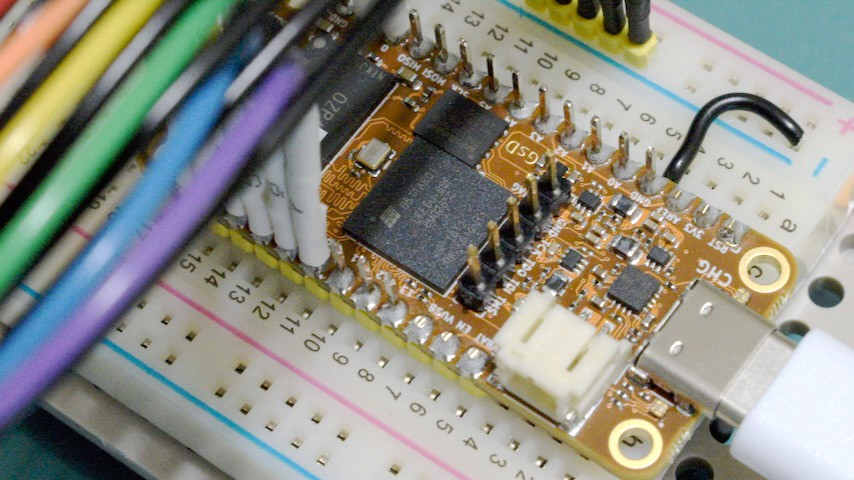

# 06 JTAG Header

Goal:

1. Prepare for being able to program my OrangeCrab 85F using JTAG instead of
   just `dfu-util`. Using JTAG will hopefully let me access the whole flash
   chip and also read back the current flash contents.

2. Prepare for printf debugging using async serial over GPIO pins. I'm assuming
   GPIO serial will be easier to get working than USB CDC. Hopefully, starting
   with GPIO serial will make it easier to bring up a working USB CDC serial
   console.

## Results:

1. JTAG header pins are ready to use:

2. Tigard board is ordered and on the way

## Plan:

1. Solder on a 5 position JTAG pin header

2. Order a USB JTAG interface board

## Lab Notes

1. Before soldering on the header pins, I masked off the bottom of the board
   with [polyimide tape](https://www.adafruit.com/product/3057) to protect the
   nearby microSD socket and bypass capacitors from splashes of flux or solder.

2. Soldering went fine. I used:
   - [Hakko FX-888D](https://www.adafruit.com/product/1204) soldering station
   - [Stickvise PCB Vise](https://www.adafruit.com/product/3197)
   - [Stickvise Part Lifter](https://www.adafruit.com/product/4705)

3. Visual inspection after soldering was good. Smoke test was good.

4. I ordered a Tigard multi-protocol interface board from Mouser (see
   [Tigard on Github](https://github.com/tigard-tools/tigard) and
   [Tigard on Crowd Supply](https://www.crowdsupply.com/securinghw/tigard)).
   My main selection criteria were:
   - FTDI FT2232H should work with [ecpprog](https://github.com/gregdavill/ecpprog)
   - FT2232H supports JTAG and CDC serial together over the same USB cable
   - Tigard board comes with premade wiring harness with heatshrink labels

   I'm not sure if I really need JTAG and async serial over GPIO for this
   project. I might be able to get by with `dfu-util` for flashing and USB CDC
   (implemented in gateware on the OrangeCrab's ECP5). But, if I run into
   trouble, having JTAG and GPIO serial should make debugging easier.

   Comparing Tigard to other JTAG interfaces I considered, the big selling
   point for me was premade wiring harnesses with labels.
