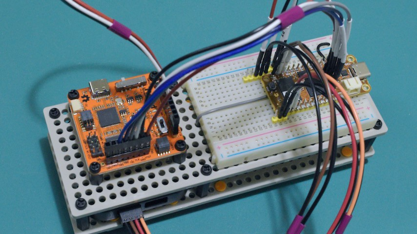

# 07 Try Tigard JTAG


## Goals

1. Mount Tigard and wire it up to the OrangeCrab 85F

2. Try `openOCD` with Tigard JTAG interface

3. Try `tio` with Tigard UART, capturing TX pin on logic analyzer

4. Try `ecpprog` with Tigard JTAG interface


## Results

1. New dev rig with OrangeCrab 85F, logic analyzer, and Tigard started like
   this:

   

   But, after getting a bunch of JTAG flash verification errors, I simplified
   the wiring like this with the hope of better JTAG signal quality:

   

   The changes were mostly aimed at avoiding ground loops.

2. Basic `openocd` Tigard JTAG connection works:

    ```console
    $ openocd -f interface/ftdi/tigard.cfg -f fpga/lattice_ecp5.cfg
    Open On-Chip Debugger 0.12.0
    Licensed under GNU GPL v2
    For bug reports, read
        http://openocd.org/doc/doxygen/bugs.html
    none separate

    Info : auto-selecting first available session transport "jtag". To \
        override use 'transport select <transport>'.
    Info : Listening on port 6666 for tcl connections
    Info : Listening on port 4444 for telnet connections
    Warn : An adapter speed is not selected in the init scripts. OpenOCD will \
        try to run the adapter at the low speed (100 kHz)
    Warn : To remove this warnings and achieve reasonable communication speed \
        with the target, set "adapter speed" or "jtag_rclk" in the init scripts.
    Info : clock speed 100 kHz
    Info : JTAG tap: ecp5.tap tap/device found: 0x41113043 (mfg: 0x021 \
        (Lattice Semi.), part: 0x1113, ver: 0x4)
    Warn : gdb services need one or more targets defined
    ^Cshutdown command invoked
    ```

3. Sending some 8N1 115200 baud serial through the Tigard UART works:

    ```console
    $ tio --local-echo --map OCRNL,ONLCRNL --timestamp-format 24hour-start \
      /dev/serial/by-id/usb-SecuringHardware.com_Tigard_V1.1_TG110bb4-if00-port0
    [00:00:00.000] tio v2.5
    [00:00:00.000] Press ctrl-t q to quit
    [00:00:00.000] Connected
    test
    [00:00:04.845] Disconnected
    ```

    

4. Flashing bitstreams and code with `ecpprog` works, but it seems unreliable.
   I get uncomfortably frequent flash verification errors, and I'm not
   convinced that `ecpprog` is handling the `-k` and `-s` speed selection
   arguments appropriately. The progress indicator kinda looks to me like it
   goes at the same speed regardless of what arguments I pass in.

   To use `ecpprog` with Tigard, you need to specify the second interface of
   the FT2232H by adding a `-I B` flag, since Tigard uses the first interface
   for its UART. Apparently `ecpprog` was written for some different JTAG probe
   that used the first FT2232H interface for JTAG.

   Anyhow, checking the ECP5 IDCODE looks like this:

    ```console
    $ ecpprog -I B -t
    init..
    IDCODE: 0x41113043 (LFE5U-85)
    ECP5 Status Register: 0x00200100
    flash ID: 0xEF 0x40 0x18
    Bye.
    ```

   Restoring the bootloader after you trash it looks like this (default flash
   offset is 0):

    ```console
    $ ecpprog -s -I B foboot-v3.1-orangecrab-r0.2-85F.bit
    init..
    IDCODE: 0x41113043 (LFE5U-85)
    ECP5 Status Register: 0x00200100
    reset..
    flash ID: 0xEF 0x40 0x18
    file size: 415247
    erase 64kB sector at 0x000000..
    erase 64kB sector at 0x010000..
    erase 64kB sector at 0x020000..
    erase 64kB sector at 0x030000..
    erase 64kB sector at 0x040000..
    erase 64kB sector at 0x050000..
    erase 64kB sector at 0x060000..
    programming..  415247/415247
    verify..       415247/415247  VERIFY OK
    Bye.
    ```

   Flashing a bitstream to the 0x8000 (512k) DFU slot looks like this (note the
   `-o 512k`):

    ```console
    $ cd ~/code/ocfpga/experiments/04_try_prebuilt_firmware/prebuilt/
    $ ecpprog -k 20 -a -o 512k -I B orangecrab-reboot-85F.bit
    init..
    IDCODE: 0x41113043 (LFE5U-85)
    ECP5 Status Register: 0x00200100
    reset..
    flash ID: 0xEF 0x40 0x18
    file size: 280518
    erase 64kB sector at 0x080000..
    erase 64kB sector at 0x090000..
    erase 64kB sector at 0x0A0000..
    erase 64kB sector at 0x0B0000..
    erase 64kB sector at 0x0C0000..
    programming..  280518/280518
    verify..       280518/280518  VERIFY OK
    rebooting ECP5...
    Bye.
    ```

   Flashing to the 0x100000 (1M) DFU slot looks like this (note the `-o 1M`):

    ```console
    $ ecpprog.sh -k 30 -a -o 1M -I B button_85F.dfu
    init..
    IDCODE: 0x41113043 (LFE5U-85)
    ECP5 Status Register: 0x00200100
    reset..
    flash ID: 0xEF 0x40 0x18
    file size: 1504
    erase 64kB sector at 0x100000..
    programming..  1504/1504
    verify..       1504/1504  VERIFY OK
    rebooting ECP5...
    Bye.
    ```

   But, that code won't actually run unless there's an RV32 SoC bitstream in
   the 0x8000 slot with a boot rom that tries to run code from 0x100000. To
   run bare RV32I binaries, you can flash them to 0x80000. It doesn't seem
   like that should work, but it does. Apparently the bootloader has some type
   of auto-detection logic that will accept either RV32I code or an ECP5
   bitstream at the 0x80000 address. I'm confused about this.


## Lab Notes

1. I took apart my old dev rig and added another universal plate to make room
   for the Tigard. The new rig is a sandwich of Tamiya universal plates joined
   with M3 nylon standoffs. The logic analyzer is in the middle with the Tigard
   and OrangeCrab on the top.

   Logic analyzer wiring is the same as before. Tigard UART and JTAG wiring are
   new. Note that, at least for the openOCD tigard.cfg distro config (see
   below), JTAG needs to be wired with the jumper labels and header pin labels
   matching (TDO->TDO and TDI->TDI):

   | Tigard UART | Tigard JTAG  | Logic 8 | OrangeCrab | Feather Spec |
   | ----------- | ------------ | ------- | ---------- | ------------ |
   |             |          GND |         | GND (jtag) |              |
   |             |          TCK |         | TCK        |              |
   |             |          TDO |         | TDO        |              |
   |             |          TDI |         | TDI        |              |
   |             |          TMS |         | TMS        |              |

   | Tigard UART | Tigard JTAG  | Logic 8 | OrangeCrab | Feather Spec |
   | ----------- | ------------ | ------- | ---------- | ------------ |
   |             |              |         | RST        | Rst          |
   |        VTGT |         VTGT |         | 3V3        | 3.3V         |
   |             |              |         | Aref       | Aref         |
   |             |              | GND0-7  | GND        | GND          |
   |             |              |         | A0         | A0           |
   |             |              |         | A1         | A1           |
   |             |              |         | A2         | A2           |
   |             |              |         | A3         | A3           |
   |             |              |         | A4         | A4 / D24     |
   |             |              |         | A5         | A5 / D25     |
   |             |              |         | SCK        | SCK          |
   |             |              |         | MOSI       | MO           |
   |             |              |         | MISO       | MI           |
   |          TX |              | 0       | 0          | RX / D0      |
   |          RX |              | 1       | 1          | TX / D1      |
   |         GND |              |         | GND        | GND          |

   | Tigard UART | Tigard JTAG  | Logic 8 | OrangeCrab | Feather Spec |
   | ----------- | ------------ | ------- | ---------- | ------------ |
   |             |              | 2       | SDA        | SDA          |
   |             |              | 3       | SCL        | SCL          |
   |             |              | 4       | 5          | D5           |
   |             |              | 5       | 6          | D6           |
   |             |              | 6       | 9          | D9           |
   |             |              | 7       | 10         | D10          |
   |             |              |         | 11         | D11          |
   |             |              |         | 12         | D12          |
   |             |              |         | 13         | D13          |

   Also see: https://learn.adafruit.com/adafruit-feather/feather-specification

2. Tigard switches are set for `VTGT` (level shifters) and `JTAG SPI`.

3. Install `openocd` and `tio`:

   ```console
   $ sudo apt install openocd tio
   ```


### Tigard JTAG with openocd

4. Researching openOCD configs...

   - [orangecrab-hardware/contrib/openocd/orangecrab-85f.cfg](https://github.com/orangecrab-fpga/orangecrab-hardware/blob/f176a3f87ea1b35bee12e4b1aa4148b1dfcae233/contrib/openocd/orangecrab-85f.cfg)
   does not specify the JTAG probe it was intended for, but the USB IDs are
   for something based on the FTDI FT2232H/D chip.

   - [tigard-tools/tigard/README.md](https://github.com/tigard-tools/tigard/tree/d822c4e9425e1fd5c4f62631a532aa64946c526c?tab=readme-ov-file#jtag-debug-on-jtag-or-cortex-header)
   gives an example openOCD config for Tigard JTAG.

   - OpenOCD [HTML documentation](https://openocd.org/doc/html/index.html)

5. OpenOCD docs [Running](https://openocd.org/doc/html/Running.html) page notes:

   - `openocd` looks for `openocd.cfg` config file in a search path including
     the current directory, `$HOME/.config/openocd`, and `$HOME/.openocd`..

   - Refer to "OpenOCD Project Setup" page for info on default config files

6. [OpenOCD Project Setup](https://openocd.org/doc/html/OpenOCD-Project-Setup.html)
   page notes:

   OpenOCD scripts directory is usually `/usr/share/openocd/scripts` on Linux
   so, let's see what's there...

    ```console
    $ cd /usr/share/openocd/scripts
    $ find * -type f | grep -i 'tigard\|orange\|ecp5'
    fpga/lattice_ecp5.cfg
    interface/ftdi/tigard.cfg
    ```

   Looks like openocd already knows about the ECP5 and Tigard (v1.1). The
   contents of `interface/ftdi/tigard.cfg` are mostly the same as the example
   from `tigard-tools/README.md`, with the exception of how the config keywords
   are spelled. For example, the readme uses `ftdi_vid_pid` and
   `ftdi_layout_init` while the distro .cfg file uses `ftdi vid_pid` and
   `ftdi layout_init`. Potentially important differences:

   - README includes `adapter_khz 2000`

   - distro .cfg includes `reset_config ...` with a comment about using
     push-pull IO for reset modes rather than open-drain

   Comparing `fpga/lattice_ecp5.cfg` (ECP5 distro config) with
   `orangecrab-hardware/contrib/openocd/orangecrab-85f.cfg` (orangecrab
   config), the main differences are:

   - orangecrab config includes settings for FTDI 0403:6010 (FT2232H), but they
     don't match Tigard (channel 0 instead of 1, different layout_init values)

   - orangecrab config sets `adapter speed 5000`

   - ECP5 distro config includes `expected-id` values for many ECP5 devices
     while orangecrab config only includes one 85F device

7. Possible `openocd` config file for my setup:

    ```
    # openocd.cfg for OrangeCrab 85F + Tigard JTAG
    source [find interface/ftdi/tigard.cfg]
    source [find fpga/lattice_ecp5.cfg]
    ```

8. Attempting to run `openocd` with the equivalent command line config...

    ```console
    $ openocd -f interface/ftdi/tigard.cfg -f fpga/lattice_ecp5.cfg
    Open On-Chip Debugger 0.12.0
    Licensed under GNU GPL v2
    For bug reports, read
    http://openocd.org/doc/doxygen/bugs.html
    none separate

    Info : auto-selecting first available session transport "jtag". To \
        override use 'transport select <transport>'.
    Info : Listening on port 6666 for tcl connections
    Info : Listening on port 4444 for telnet connections
    Warn : An adapter speed is not selected in the init scripts. OpenOCD will \
        try to run the adapter at the low speed (100 kHz)
    Warn : To remove this warnings and achieve reasonable communication speed \
        with the target, set "adapter speed" or "jtag_rclk" in the init scripts.
    Info : clock speed 100 kHz
    Error: JTAG scan chain interrogation failed: all ones
    Error: Check JTAG interface, timings, target power, etc.
    Error: Trying to use configured scan chain anyway...
    Error: ecp5.tap: IR capture error; saw 0xff not 0x1
    Warn : Bypassing JTAG setup events due to errors
    Warn : gdb services need one or more targets defined
    ^Cshutdown command invoked
    ```

   That didn't work. Maybe `JTAG scan chain interrogation failed: all ones` is
   because TDO and TDI need to be switched? I wasn't sure from the Tigard docs
   if the TDI and TDO wires are labeled with the intent of being wired in the
   manner of a PCB JTAG daisy chain (TDI->TDO and TDO->TDI), or if you're
   supposed to match them to the JTAG header labels like, TDI->TDI and
   TDO->TDO.

9. After I swapped TDI and TDO, it works. Now the jumper wire labels match the
   header pin labels (TDI->TDI and TDO->TDO).

    ```console
    $ openocd -f interface/ftdi/tigard.cfg -f fpga/lattice_ecp5.cfg
    Open On-Chip Debugger 0.12.0
    Licensed under GNU GPL v2
    For bug reports, read
        http://openocd.org/doc/doxygen/bugs.html
    none separate

    Info : auto-selecting first available session transport "jtag". To \
        override use 'transport select <transport>'.
    Info : Listening on port 6666 for tcl connections
    Info : Listening on port 4444 for telnet connections
    Warn : An adapter speed is not selected in the init scripts. OpenOCD will \
        try to run the adapter at the low speed (100 kHz)
    Warn : To remove this warnings and achieve reasonable communication speed \
        with the target, set "adapter speed" or "jtag_rclk" in the init scripts.
    Info : clock speed 100 kHz
    Info : JTAG tap: ecp5.tap tap/device found: 0x41113043 (mfg: 0x021 \
        (Lattice Semi.), part: 0x1113, ver: 0x4)
    Warn : gdb services need one or more targets defined
    ^Cshutdown command invoked
    ```


### Tigard UART with tio

10. Now attempt to find the Tigard's serial port...

    ```console
    $ ls /dev/serial/by-id/
    usb-SecuringHardware.com_Tigard_V1.1_TG110bb4-if00-port0
    $ cd /dev/serial/by-id/
    $ file usb-SecuringHardware.com_Tigard_V1.1_TG110bb4-if00-port0
    usb-SecuringHardware.com_Tigard_V1.1_TG110bb4-if00-port0: symbolic link \
        to ../../ttyUSB0
    ```

11. Try sending some stuff from `tio` and capturing the Tigard UART's TX pin
    output on the logic analyzer:

    Typing some stuff in `tio` with local echo:

    ```console
    $ tio --local-echo --map OCRNL,ONLCRNL --timestamp-format 24hour-start \
      /dev/serial/by-id/usb-SecuringHardware.com_Tigard_V1.1_TG110bb4-if00-port0
    [00:00:00.000] tio v2.5
    [00:00:00.000] Press ctrl-t q to quit
    [00:00:00.000] Connected
    test
    [00:00:04.845] Disconnected
    ```

    The `--map ...` argument translates the CR from my Enter key into a NL,
    then the NL into a CR-NL sequence before the local echo to my terminal.
    Without that mapping, Enter would just echo a CR, and the disconnect
    message would cover up that line so you couldn't see what I had typed.

    This is what it looks like in the logic analyzer (wide view):

    

    And this is a zoomed in view with timing markers for the first character:

    

    I was sending 8N1 at a requested baud of 115200. The measured time between
    markers for the first character was 78.2 µs. Calculating the time for 1
    start bit and 8 data bits, it should take:

    `(1e6 [µs/s]) / (115200 [symbol/s]) * (9 [symbols]) = 78.125 µs`

    So the percentage difference would be:

    `(100 [%]) * (78.2 - 78.125) / 78.125 = 0.0960 %`

    That's pretty close.


### Programming with Tigard JTAG and ecpprog

12. Now let's try installing `ecpprog`.

    First, fork [gregdavill/ecpprog](https://github.com/gregdavill/ecpprog) as
    [samblenny/ecpprog](https://github.com/samblenny/ecpprog).

    Then build it...

    ```console
    $ cd ~/bin
    $ git clone https://github.com/samblenny/ecpprog.git
    $ cd ecpprog
    $ less README.md
    $ # need to install libftdi-dev
    $ sudo apt install libftdi-dev
    $ cd ecpprog
    $ PREFIX=. make
      # seems okay? but it complained about not finding pkg-config
      # gonna install pkg-config and try again
    $ sudo apt install pkg-config
    $ make clean
    $ PREFIX=. make
    ```

    Running `make` left created the program `$HOME/bin/ecpprog/ecpprog/ecpprog`
    which is kinda awkward. I don't want to do `sudo make install`, so instead
    I'll put a script in `~/bin/ecpprog.sh`:

    ```console
    $ cat <<EOF > ~/bin/ecpprog.sh
    #!/bin/sh
    \$HOME/bin/ecpprog/ecpprog/ecpprog \$@
    EOF
    $ cat ~/bin/ecpprog.sh
    #!/bin/sh
    $HOME/bin/ecpprog/ecpprog/ecpprog $@
    $ chmod +x ~/bin/ecpprog.sh
    ```

    Try the script (it works):

    ```console
    $ ecpprog.sh --help
    Simple programming tool for Lattice ECP5/NX using FTDI-based JTAG programmers.
    Usage: /home/sam/bin/ecpprog/ecpprog/ecpprog [-b|-n|-c] <input file>
           /home/sam/bin/ecpprog/ecpprog/ecpprog -r|-R<bytes> <output file>
           /home/sam/bin/ecpprog/ecpprog/ecpprog -S <input file>
           /home/sam/bin/ecpprog/ecpprog/ecpprog -t

    General options:
    ...
    ```

13. Try using `ecpprog` to read the ECP5's IDCODE over Tigard JTAG:

    ```console
    $ ecpprog.sh -t
    init..
    IDCODE: 0xffffffff does not match :(
    flash ID: 0xFF 0xFF 0xFF
    Bye.
    ```

    Consulting the `--help`, that probably failed because `ecpprog` defaults to
    using interface `A` of multi-interface FTDI devices. I'm guessing that `A`
    corresponds to `ftdi channel 0` in `openocd` config, which is wrong for
    Tigard. So, probably, it will work if I include a `-I B` flag to use the
    second FT2232H interface...

    ```console
    $ ecpprog.sh -I B -t
    init..
    IDCODE: 0x41113043 (LFE5U-85)
    ECP5 Status Register: 0x00200100
    flash ID: 0xEF 0x40 0x18
    Bye.
    ```

    It works!

14. Now what if I try to flash a bitstream?

    ```console
    $ cd ~/code/ocfpga/experiments/04_try_prebuilt_firmware/prebuilt/
    $ ls -1
    blink_fw.dfu
    combine_85F.dfu
    combine.dfu
    orangecrab-reboot-85F.bit
    orangecrab-test-85F.bit
    $ ecpprog.sh -I B orangecrab-reboot-85F.bit
    init..
    IDCODE: 0x41113043 (LFE5U-85)
    ECP5 Status Register: 0x00200000
    reset..
    flash ID: 0xEF 0x40 0x18
    file size: 280518
    erase 64kB sector at 0x000000..
    erase 64kB sector at 0x010000..
    erase 64kB sector at 0x020000..
    erase 64kB sector at 0x030000..
    erase 64kB sector at 0x040000..
    programming..  280518/280518
    verify..       280518/280518  VERIFY OK
    Bye.
    ```

    Hmm... now the LED just blinks green, even if I try to reboot in DFU mode.
    This doesn't seem good 😰. I'm guessing I probably just overwrote the
    bootloader. oopsie.

15. So, where's a prebuilt copy of the bootloader, I wonder...

    This looks like probably what I need:
    [orangecrab-fpga/production-test-swprebuilt/foboot-v3.1-orangecrab-r0.2-85F.bit](https://github.com/orangecrab-fpga/production-test-sw/blob/main/prebuilt/foboot-v3.1-orangecrab-r0.2-85F.bit)

    I just added that to my [../04_try_prebuilt_firmware/download-firmware.pl](../04_try_prebuilt_firmware/download-firmware.pl)
    script and tried flasing it with `ecpprog` (still no luck):

    ```console
    $ ecpprog.sh -I B foboot-v3.1-orangecrab-r0.2-85F.bit
    init..
    IDCODE: 0x41113043 (LFE5U-85)
    ECP5 Status Register: 0x00200100
    reset..
    flash ID: 0x00 0x00 0x00
    file size: 415247
    erase 64kB sector at 0x000000..
    erase 64kB sector at 0x010000..
    erase 64kB sector at 0x020000..
    erase 64kB sector at 0x030000..
    erase 64kB sector at 0x040000..
    erase 64kB sector at 0x050000..
    erase 64kB sector at 0x060000..
    programming..  415247/415247
    verify..       4096/415247Found difference between flash and file!
    ABORT.
    ```

    Searching for similar problems turns up
    [orangecrab-examples/issue/19](https://github.com/orangecrab-fpga/orangecrab-examples/issues/19)
    which describes the procedure for flashing the bootloader as basically the
    same thing I'm already doing.

    My guess is that my flying-wire JTAG connection is not reliable at the fast
    JTAG clock speed that `ecpprog` wants to use (default 6 MHz?). I've been
    trying to slow it down with the `-k` and `-s` arguments, but I wonder if
    the order of arguments matters.

    Trying it again with `-s` up front:

    ```console
    $ ecpprog.sh -s -I B foboot-v3.1-orangecrab-r0.2-85F.bit
    init..
    IDCODE: 0x41113043 (LFE5U-85)
    ECP5 Status Register: 0x00200100
    reset..
    flash ID: 0xEF 0x40 0x18
    file size: 415247
    erase 64kB sector at 0x000000..
    erase 64kB sector at 0x010000..
    erase 64kB sector at 0x020000..
    erase 64kB sector at 0x030000..
    erase 64kB sector at 0x040000..
    erase 64kB sector at 0x050000..
    erase 64kB sector at 0x060000..
    programming..  415247/415247
    verify..       415247/415247  VERIFY OK
    Bye.
    ```

    That worked! Now I can boot into DFU mode with the rainbow-fade LED.

    After repeating the bootloader flash a few times with `-s` before and after
    `-I B`, it seems like the order of arguments is important. When `-s` comes
    at the front, it works.

16. Try flashing the bootloader at 1 MHz to see if it's more reliable than
    6 MHz but faster than `-s`...

    ```console
    $ ecpprog.sh -k 6 -I B foboot-v3.1-orangecrab-r0.2-85F.bit
    init..
    IDCODE: 0x41113043 (LFE5U-85)
    ECP5 Status Register: 0x00200000
    reset..
    flash ID: 0xEF 0x40 0x18
    file size: 415247
    erase 64kB sector at 0x000000..
    erase 64kB sector at 0x010000..
    erase 64kB sector at 0x020000..
    erase 64kB sector at 0x030000..
    erase 64kB sector at 0x040000..
    erase 64kB sector at 0x050000..
    erase 64kB sector at 0x060000..
    programming..  415247/415247
    verify..       415247/415247  VERIFY OK
    Bye.
    ```

    That worked a few times in a row with no errors. One thing about
    programming this way is that the OrangeCrab doesn't reboot until I power
    cycle it by unplugging the USB cable. Wonder if I can improve on that?

17. Try rebooting after flashing firmware (add `-a` argument):

    ```console
    $ ecpprog.sh -k 6 -a -I B foboot-v3.1-orangecrab-r0.2-85F.bit
    init..
    IDCODE: 0x41113043 (LFE5U-85)
    ECP5 Status Register: 0x00200000
    reset..
    flash ID: 0xEF 0x40 0x18
    file size: 415247
    erase 64kB sector at 0x000000..
    erase 64kB sector at 0x010000..
    erase 64kB sector at 0x020000..
    erase 64kB sector at 0x030000..
    erase 64kB sector at 0x040000..
    erase 64kB sector at 0x050000..
    erase 64kB sector at 0x060000..
    programming..  415247/415247
    verify..       415247/415247  VERIFY OK
    rebooting ECP5...
    Bye.
    ```

    That worked! Now the LED is red, but it will boot into DFU mode with the
    rainbow fade if I power cycle the board.

18. Try flashing to the user bitstream offset...

    But what is the user bitstream base address? And how to tell that to
    `ecpprog`?

    According to
    [orangecrab-examples/litex/README-CircuitPython-Example.md](https://github.com/orangecrab-fpga/orangecrab-examples/blob/9006469bd5873228244a693d380d6f20e7398a7d/litex/README-CircuitPython-Example.md#combine-soc-and-circuit-python-firmware-and-flash),
    The user bitstream starts at flash address `0x80000` (524288), and the user
    code region starts at flash address `0x100000` (1048576). As I'm trying to
    match those addresses against the ones that show up for DFU devices in
    `lsusb`, I see that the bootloader's DFU devices aren't showing up in
    `lsusb` now. The rainbow-fade LED is good. The DFU devices show up in
    `dmesg`, but they aren't in `lsusb`.

    My guess is that, at some point, I was JTAG programming while the board was
    in DFU mode, and that stopping the bootloader SoC's clock caused it to stop
    talking USB properly to the host computer's kernel. Presumably that made
    the Debian kernel mad. I'm going to try rebooting Debian to see if the DFU
    devices will start showing up again.

    Also, I had another flash verification failure at 1 MHz JTAG clock, so I
    set it down to 500 kHz (`-k 12`). I'm going to try removing some of the
    logic analyzer wires and re-do the ground wires to avoid possible ground
    loops. Perhaps that will help me avoid JTAG errors.

    This is how the new wiring looks:

    

    Changes:
    - Removed 4 channels of logic analyzer wires
    - Taped each of the 4 remaining logic analyzer signal wires to their ground
      wire (rather than previous method of bundling all signal and ground
    - Connected only 1 logic analyzer ground to OrangeCrab GND pin
    - Connected only 1 Tigard ground (JTAG) to OrangeCrab GND pin (JTAG port)
    - Connected only 1 Tigard VTGT (JTAG) to OrangeCrab 3V3 pin
    - Parked all remaining ground and VTGT wires on their own breadboard row

    I'm hoping this will help me avoid JTAG flash verification errors by
    reducing weird inductive and RF stuff involving ground loops and such.

    Also, after I rebooted Debian on my dev box, the DFU device is showing up
    in `lsusb` again.

    So, getting back to the main task, let's check the DFU device addresses to
    compare against the CircuitPython example readme...

    ```console
    $ dfu-util -d 1209:5af0 -l | grep 1209
    Found DFU: [1209:5af0] ver=0101, devnum=7, cfg=1, intf=0, path="1-2", \
        alt=1, name="0x00100000 RISC-V Firmware", serial="UNKNOWN"
    Found DFU: [1209:5af0] ver=0101, devnum=7, cfg=1, intf=0, path="1-2", \
        alt=0, name="0x00080000 Bitstream", serial="UNKNOWN"
    ```

    So, the addresses match:

    |                  | User Bitstream | User Firmware |
    | ---------------- | -------------- | ------------- |
    | Example README   | `0x80000`      | `0x100000`    |
    | dfu-util alt=0   | `0x00080000`   |               |
    | dfu-util alt=1   |                | `0x00100000`  |
    | base 10          | 524288         | 1048576       |
    | IEC binary units | 512 KiB        | 1 MiB         |
    | `ecpprog` flag   | `-o 512k`      | `-o 1M`       |

    When the help text for `ecpprog` speaks of "kilobytes" and "megabytes". It
    appears to be using the definitions 1k = 1024 bytes and 1M = 1048576 bytes.

    Finally, let's try flashing `orangecrab-reboot-85F.bit` to the user
    bitstream slot at 0x8000 (512 KiB)...

    ```console
    $ cd ~/code/ocfpga/experiments/04_try_prebuilt_firmware/prebuilt/
    $ ecpprog.sh -k 20 -a -o 512k -I B orangecrab-reboot-85F.bit
    init..
    IDCODE: 0x41113043 (LFE5U-85)
    ECP5 Status Register: 0x00200100
    reset..
    flash ID: 0xEF 0x40 0x18
    file size: 280518
    erase 64kB sector at 0x080000..
    erase 64kB sector at 0x090000..
    erase 64kB sector at 0x0A0000..
    erase 64kB sector at 0x0B0000..
    erase 64kB sector at 0x0C0000..
    programming..  280518/280518
    verify..       280518/280518  VERIFY OK
    rebooting ECP5...
    Bye.
    ```

    I omitted the console log for my first two attempts with `-k 6` (1 MHz)
    and `-k 12` (500 kHz), which both failed with a flash verification error.
    It seems like `-k 20` (300 kHz) is okay?

    Now the LED blinks green until I press the button, at which point it goes
    to the bootloader's rainbow fade.

19. For one last trick, let's try flashing the orangecrab-examples riscv/button
    example to the firmware area (0x100000 = 1M)...

    ```console
    $ ecpprog.sh -k 20 -a -o 1M -I B button_85F.dfu
    init..
    IDCODE: 0x41113043 (LFE5U-85)
    ECP5 Status Register: 0x00200100
    reset..
    flash ID: 0x00 0x00 0x00
    file size: 1504
    erase 64kB sector at 0x100000..
    programming..  1504/1504
    verify..       1504/1504Found difference between flash and file!
    ABORT.
    ```

    Ouch. That failed with a verification error, so let's try again slower:

    ```console
    $ ecpprog.sh -k 30 -a -o 1M -I B button_85F.dfu
    init..
    IDCODE: 0x41113043 (LFE5U-85)
    ECP5 Status Register: 0x00200100
    reset..
    flash ID: 0xEF 0x40 0x18
    file size: 1504
    erase 64kB sector at 0x100000..
    programming..  1504/1504
    verify..       1504/1504  VERIFY OK
    rebooting ECP5...
    Bye.
    ```

    That went okay, but the LED is still doing the reboot firmware pattern.
    The button example isn't running. So, let's try again at 0x8000:

    ```console
    $ ecpprog.sh -k 30 -a -o 512k -I B button_85F.dfu
    init..
    IDCODE: 0x41113043 (LFE5U-85)
    ECP5 Status Register: 0x00200100
    reset..
    flash ID: 0x00 0x00 0x00
    file size: 1504
    erase 64kB sector at 0x080000..
    programming..  1504/1504
    verify..       1504/1504Found difference between flash and file!
    ABORT.
    ```

    Another verification error 🤬! That is supposed to be the slowest speed,
    so, I'll just try running the same command again:

    ```console
    $ ecpprog.sh -k 30 -a -o 512k -I B button_85F.dfu
    init..
    IDCODE: 0x41113043 (LFE5U-85)
    ECP5 Status Register: 0x00200100
    reset..
    flash ID: 0xEF 0x40 0x18
    file size: 1504
    erase 64kB sector at 0x080000..
    programming..  1504/1504
    verify..       1504/1504  VERIFY OK
    rebooting ECP5...
    Bye.
    ```

    🎉 That works! The LED is responding to the button presses with the red,
    blue, green cycle, as it should be.

    But, I'm quite puzzled about what's going on. I flashed a RISC-V binary to
    the bitstream slot, but the code is running. Maybe the bootloader has some
    kind of auto-detection thing where the "bitstream" slot at 0x8000 can
    actually take either a bitstream or a RISC-V binary, and it automagically
    decides what do do? So mysterious.
