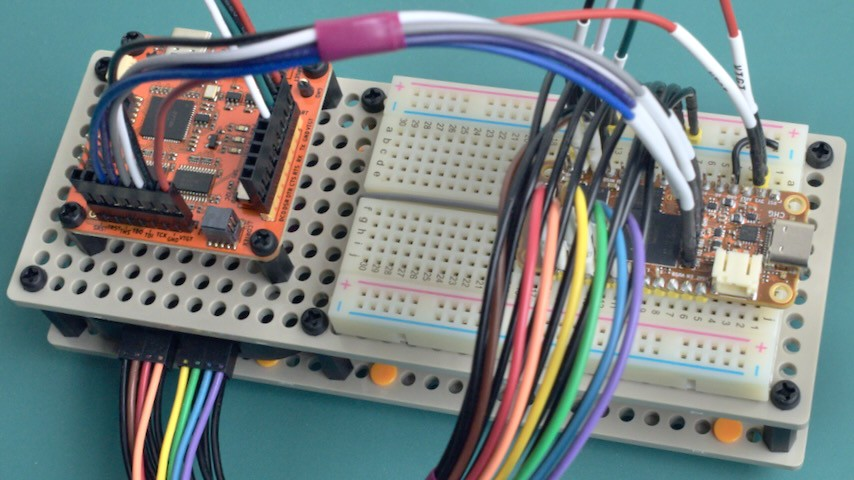
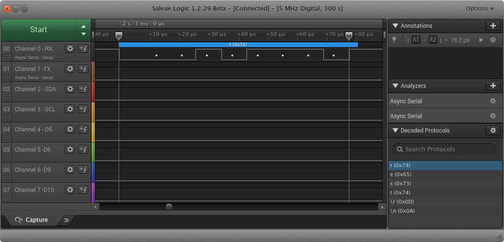
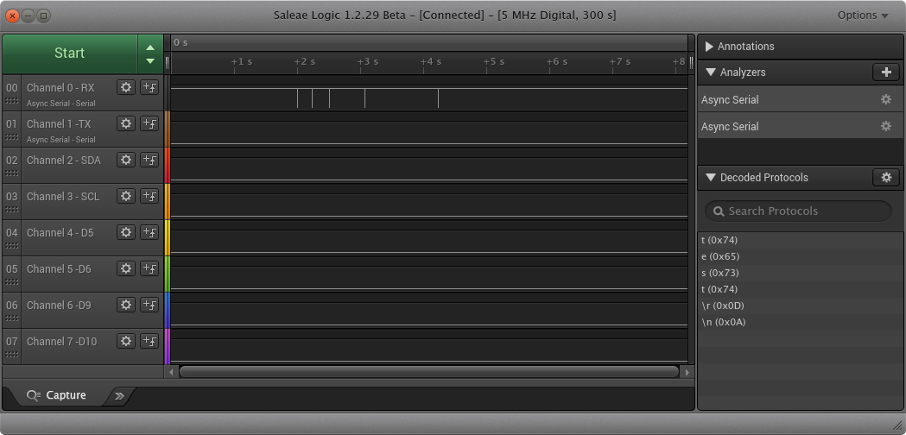

# 07 Try Tigard JTAG


## Goals

1. Mount Tigard and wire it up to the OrangeCrab 85F

2. Try `openOCD` with Tigard JTAG interface

3. Try `tio` with Tigard UART, capturing TX pin on logic analyzer

4. Try `ecpprog` with Tigard JTAG interface


## Results

1. New dev rig with OrangeCrab 85F, logic analyzer, and Tigard looks like this:

   

2. Basic `openocd` Tigard JTAG connection works:

    ```console
    $ openocd -f interface/ftdi/tigard.cfg -f fpga/lattice_ecp5.cfg
    Open On-Chip Debugger 0.12.0
    Licensed under GNU GPL v2
    For bug reports, read
        http://openocd.org/doc/doxygen/bugs.html
    none separate

    Info : auto-selecting first available session transport "jtag". To \
        override use 'transport select <transport>'.
    Info : Listening on port 6666 for tcl connections
    Info : Listening on port 4444 for telnet connections
    Warn : An adapter speed is not selected in the init scripts. OpenOCD will \
        try to run the adapter at the low speed (100 kHz)
    Warn : To remove this warnings and achieve reasonable communication speed \
        with the target, set "adapter speed" or "jtag_rclk" in the init scripts.
    Info : clock speed 100 kHz
    Info : JTAG tap: ecp5.tap tap/device found: 0x41113043 (mfg: 0x021 \
        (Lattice Semi.), part: 0x1113, ver: 0x4)
    Warn : gdb services need one or more targets defined
    ^Cshutdown command invoked
    ```

3. Sending some 8N1 115200 baud serial through the Tigard UART works:

    ```console
    $ tio --local-echo --map OCRNL,ONLCRNL --timestamp-format 24hour-start \
      /dev/serial/by-id/usb-SecuringHardware.com_Tigard_V1.1_TG110bb4-if00-port0
    [00:00:00.000] tio v2.5
    [00:00:00.000] Press ctrl-t q to quit
    [00:00:00.000] Connected
    test
    [00:00:04.845] Disconnected
    ```

    

4. ... *work in progress*


## Lab Notes

1. I took apart my old dev rig and added another universal plate to make room
   for the Tigard. The new rig is a sandwich of Tamiya universal plates joined
   with M3 nylon standoffs. The logic analyzer is in the middle with the Tigard
   and OrangeCrab on the top.

   Logic analyzer wiring is the same as before. Tigard UART and JTAG wiring are
   new. Note that, at least for the openOCD tigard.cfg distro config (see
   below), JTAG needs to be wired with the jumper labels and header pin labels
   matching (TDO->TDO and TDI->TDI):

   | Tigard UART | Tigard JTAG  | Logic 8 | OrangeCrab | Feather Spec |
   | ----------- | ------------ | ------- | ---------- | ------------ |
   |             |          GND |         | GND (jtag) |              |
   |             |          TCK |         | TCK        |              |
   |             |          TDO |         | TDO        |              |
   |             |          TDI |         | TDI        |              |
   |             |          TMS |         | TMS        |              |

   | Tigard UART | Tigard JTAG  | Logic 8 | OrangeCrab | Feather Spec |
   | ----------- | ------------ | ------- | ---------- | ------------ |
   |             |              |         | RST        | Rst          |
   |        VTGT |         VTGT |         | 3V3        | 3.3V         |
   |             |              |         | Aref       | Aref         |
   |             |              | GND0-7  | GND        | GND          |
   |             |              |         | A0         | A0           |
   |             |              |         | A1         | A1           |
   |             |              |         | A2         | A2           |
   |             |              |         | A3         | A3           |
   |             |              |         | A4         | A4 / D24     |
   |             |              |         | A5         | A5 / D25     |
   |             |              |         | SCK        | SCK          |
   |             |              |         | MOSI       | MO           |
   |             |              |         | MISO       | MI           |
   |          TX |              | 0       | 0          | RX / D0      |
   |          RX |              | 1       | 1          | TX / D1      |
   |         GND |              |         | GND        | GND          |

   | Tigard UART | Tigard JTAG  | Logic 8 | OrangeCrab | Feather Spec |
   | ----------- | ------------ | ------- | ---------- | ------------ |
   |             |              | 2       | SDA        | SDA          |
   |             |              | 3       | SCL        | SCL          |
   |             |              | 4       | 5          | D5           |
   |             |              | 5       | 6          | D6           |
   |             |              | 6       | 9          | D9           |
   |             |              | 7       | 10         | D10          |
   |             |              |         | 11         | D11          |
   |             |              |         | 12         | D12          |
   |             |              |         | 13         | D13          |

   Also see: https://learn.adafruit.com/adafruit-feather/feather-specification

2. Tigard switches are set for `VTGT` (level shifters) and `JTAG SPI`.

3. Install `openocd` and `tio`:

   ```console
   $ sudo apt install openocd tio
   ```

4. Researching openOCD configs...

   - [orangecrab-hardware/contrib/openocd/orangecrab-85f.cfg](https://github.com/orangecrab-fpga/orangecrab-hardware/blob/f176a3f87ea1b35bee12e4b1aa4148b1dfcae233/contrib/openocd/orangecrab-85f.cfg)
   does not specify the JTAG probe it was intended for, but the USB IDs are
   for something based on the FTDI FT2232H/D chip.

   - [tigard-tools/tigard/README.md](https://github.com/tigard-tools/tigard/tree/d822c4e9425e1fd5c4f62631a532aa64946c526c?tab=readme-ov-file#jtag-debug-on-jtag-or-cortex-header)
   gives an example openOCD config for Tigard JTAG.

   - OpenOCD [HTML documentation](https://openocd.org/doc/html/index.html)

5. OpenOCD docs [Running](https://openocd.org/doc/html/Running.html) page notes:

   - `openocd` looks for `openocd.cfg` config file in a search path including
     the current directory, `$HOME/.config/openocd`, and `$HOME/.openocd`..

   - Refer to [OpenOCD Project Setup](https://openocd.org/doc/html/OpenOCD-Project-Setup.html)
     page for info on default config files

6. [OpenOCD Project Setup](https://openocd.org/doc/html/OpenOCD-Project-Setup.html)
   page notes:

   OpenOCD scripts directory is usually `/usr/share/openocd/scripts` on Linux
   so, let's see what's there...

    ```console
    $ cd /usr/share/openocd/scripts
    $ find * -type f | grep -i 'tigard\|orange\|ecp5'
    fpga/lattice_ecp5.cfg
    interface/ftdi/tigard.cfg
    ```

   Looks like openocd already knows about the ECP5 and Tigard (v1.1). The
   contents of `interface/ftdi/tigard.cfg` are mostly the same as the example
   from `tigard-tools/README.md`, with the exception of how the config keywords
   are spelled. For example, the readme uses `ftdi_vid_pid` and
   `ftdi_layout_init` while the distro .cfg file uses `ftdi vid_pid` and
   `ftdi layout_init`. Potentially important differences:

   - README includes `adapter_khz 2000`

   - distro .cfg includes `reset_config ...` with a comment about using
     push-pull IO for reset modes rather than open-drain

   Comparing `fpga/lattice_ecp5.cfg` (ECP5 distro config) with
   `orangecrab-hardware/contrib/openocd/orangecrab-85f.cfg` (orangecrab
   config), the main differences are:

   - orangecrab config includes settings for FTDI 0403:6010 (FT2232H), but they
     don't match Tigard (channel 0 instead of 1, different layout_init values)

   - orangecrab config sets `adapter speed 5000`

   - ECP5 distro config includes `expected-id` values for many ECP5 devices
     while orangecrab config only includes one 85F device

7. Possible openocd config file for my setup:

    ```
    # openocd.cfg for OrangeCrab 85F + Tigard JTAG
    source [find interface/ftdi/tigard.cfg]
    source [find fpga/lattice_ecp5.cfg]
    ```

8. Attempting to run openocd with the equivalent command line config...

    ```console
    $ openocd -f interface/ftdi/tigard.cfg -f fpga/lattice_ecp5.cfg
    Open On-Chip Debugger 0.12.0
    Licensed under GNU GPL v2
    For bug reports, read
    http://openocd.org/doc/doxygen/bugs.html
    none separate

    Info : auto-selecting first available session transport "jtag". To \
        override use 'transport select <transport>'.
    Info : Listening on port 6666 for tcl connections
    Info : Listening on port 4444 for telnet connections
    Warn : An adapter speed is not selected in the init scripts. OpenOCD will \
        try to run the adapter at the low speed (100 kHz)
    Warn : To remove this warnings and achieve reasonable communication speed \
        with the target, set "adapter speed" or "jtag_rclk" in the init scripts.
    Info : clock speed 100 kHz
    Error: JTAG scan chain interrogation failed: all ones
    Error: Check JTAG interface, timings, target power, etc.
    Error: Trying to use configured scan chain anyway...
    Error: ecp5.tap: IR capture error; saw 0xff not 0x1
    Warn : Bypassing JTAG setup events due to errors
    Warn : gdb services need one or more targets defined
    ^Cshutdown command invoked
    ```

   That didn't work. Maybe `JTAG scan chain interrogation failed: all ones` is
   because TDO and TDI need to be switched? I wasn't sure from the Tigard docs
   if the TDI and TDO wires are labeled with the intent of being wired in the
   manner of a PCB JTAG daisy chain (TDI->TDO and TDO->TDI), or if you're
   supposed to match them to the JTAG header labels like, TDI->TDI and
   TDO->TDO.

9. After I swapped TDI and TDO, it works. Now the jumper wire labels match the
   header pin labels (TDI->TDI and TDO->TDO).

    ```console
    $ openocd -f interface/ftdi/tigard.cfg -f fpga/lattice_ecp5.cfg
    Open On-Chip Debugger 0.12.0
    Licensed under GNU GPL v2
    For bug reports, read
        http://openocd.org/doc/doxygen/bugs.html
    none separate

    Info : auto-selecting first available session transport "jtag". To \
        override use 'transport select <transport>'.
    Info : Listening on port 6666 for tcl connections
    Info : Listening on port 4444 for telnet connections
    Warn : An adapter speed is not selected in the init scripts. OpenOCD will \
        try to run the adapter at the low speed (100 kHz)
    Warn : To remove this warnings and achieve reasonable communication speed \
        with the target, set "adapter speed" or "jtag_rclk" in the init scripts.
    Info : clock speed 100 kHz
    Info : JTAG tap: ecp5.tap tap/device found: 0x41113043 (mfg: 0x021 \
        (Lattice Semi.), part: 0x1113, ver: 0x4)
    Warn : gdb services need one or more targets defined
    ^Cshutdown command invoked
    ```

10. Now attempt to find the Tigard's serial port...

    ```console
    $ ls /dev/serial/by-id/
    usb-SecuringHardware.com_Tigard_V1.1_TG110bb4-if00-port0
    $ cd /dev/serial/by-id/
    $ file usb-SecuringHardware.com_Tigard_V1.1_TG110bb4-if00-port0
    usb-SecuringHardware.com_Tigard_V1.1_TG110bb4-if00-port0: symbolic link \
        to ../../ttyUSB0
    ```

11. Try sending some stuff from `tio` and capturing the Tigard UART's TX pin
    output on the logic analyzer:

    Typing some stuff in `tio` with local echo:

    ```console
    $ tio --local-echo --map OCRNL,ONLCRNL --timestamp-format 24hour-start \
      /dev/serial/by-id/usb-SecuringHardware.com_Tigard_V1.1_TG110bb4-if00-port0
    [00:00:00.000] tio v2.5
    [00:00:00.000] Press ctrl-t q to quit
    [00:00:00.000] Connected
    test
    [00:00:04.845] Disconnected
    ```

    The `--map ...` argument translates the CR from my Enter key into a NL,
    a CR-NL sequence for local echo to my terminal. Without the mapping, Enter
    would just echo a CR, then the disconnect message would cover up that line
    so you couldn't see what I had typed.

    This is what it looks like in the logic analyzer (wide view):

    

    And this is a zoomed in view with timing markers for the first character:

    

    I was sending 8N1 at a requested baud of 115200. The measured time between
    markers for the first character was 78.2 µs. Calculating the time for 1
    start bit and 8 data bits, it should take:

    `(1e6 [µs/s]) / (115200 [symbol/s]) * (9 [symbols]) = 78.125 µs`

    So the percentage difference would be:

    `(100 [%]) * (78.2 - 78.125) / 78.2 = 0.0959 %`

    That's pretty close.
